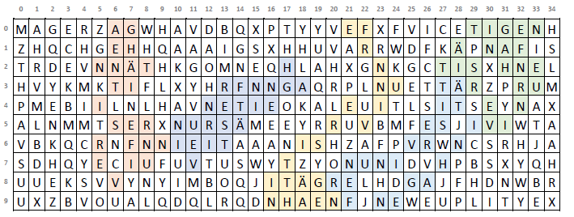

# Schlangenjagd — Backtracking Solver, Instance Generator & Validator

**Author:** Wang, Kuan   
**Email:** [wangkuan42@gmail.com](mailto:wangkuan42@gmail.com)

**Language/Runtime:** Java SE 19  
**Build/IDE:** Eclipse 2023-03 · JUnit 5.9.2 · JDOM2 2.0.6.1  

---

## Overview

This project was developed as part of a programming practicum called *“Schlangenjagd”* (literally *"snake hunt"*).  
The idea is to search for **character snakes**—words or strings that appear as connected paths inside a grid of letters, called the *jungle*.  

- A snake is defined by a specific word and a rule for how its letters can connect (neighbors in horizontal, vertical, diagonal, or custom patterns).  
- Some snakes may overlap or share fields, depending on the grid’s configuration.  
- To make the problem more challenging, each field has a usage limit and a point value, and each snake also has its own score.  

The **goal** is to automatically find the set of snakes that yields the **maximum total score** within a given time limit.  
In short: it’s a **grid search optimization problem** where we let algorithms (instead of humans) hunt for hidden words under complex constraints.

<p align="center">
  
  <br/>
  <em>Figure 1: Example of a character snake in the jungle</em>
</p>

This project implements the full toolchain for the *“Schlangenjagd”* programming practicum:

- **Backtracking Solver**  
  Search for “character snakes” in a rectangular grid using a time-bounded backtracking solver with heuristics.

- **Instance Generator**  
  Generate valid problem instances (jungles with embedded snakes) under constraints.

- **Validator & Scorer**  
  Validate & score solutions and render instances/solutions as text.

- **CLI & API**  
  Provide both a command-line interface and an embeddable Java API.

---

## Alignment with Assignment

The data model, DTD, CLI contract, and functional requirements are aligned with the official assignment document:

- Sections 3–4: Data model  
- Backtracking algorithm sketch  
- XML DTD  
- CLI ablauf flags  
- API mode

## Table of Contents
- [Problem Statement (short)](#problem-statement-short)
- [Key Features](#key-features)
- [Project Layout](#project-layout)
- [Core Algorithms](#core-algorithms)
- [Data Model & XML I/O](#data-model--xml-io)
- [Command-Line Interface](#command-line-interface)
- [Java API](#java-api)
- [Build, Run & Test](#build-run--test)
- [Design Notes & Heuristics](#design-notes--heuristics)
- [Performance, Limits & Future Work](#performance-limits--future-work)

---

## Problem Statement (short)

**Given:**
- A rectangular jungle of fields (cells with characters).
- One or more snake types defined by a string and a neighborhood structure (`Distance(d)` or `Jump(dx,dy)`).
- Per-field capacity (max concurrent usage) and points; per-snake points.
- A time limit.

**Task:**  
Find a set of snakes placed over the jungle that maximizes total score (sum of snake points + field points) while respecting neighborhood and capacity constraints.  

**Format:**  
Instances and solutions are represented in a specified **XML format** (with a given DTD).

---

## Key Features

- **Backtracking Solver**  
  Time-bounded backtracking search with prioritization hooks (greedy ordering by points/capacity).

- **Instance Generator**  
  Populates non-overlapping snakes and fills remaining cells with permitted characters.

- **Validator & Scorer**  
  Checks the four required admissibility conditions and scores solutions regardless of admissibility.

- **Text Renderer**  
  Visualizes instances and highlights found snakes.

- **Clean OO Separation**  
  Model, I/O, algorithm, rendering, main/API.

- **Testing**  
  JUnit 5 test suite covering model logic, XML I/O, generator, and solver building blocks.


## Project Layout

```bash
4067827_Wang_Kuan/
├─ src/
│  └─ de/fernuni/kurs01584/ss23/
│     ├─ hauptkomponente/
│     │  ├─ Schlangenjagd.java           # CLI entry + API implementation
│     │  └─ SchlangenjagdAPI.java        # Public API
│     ├─ algorithmus/
│     │  ├─ SchlangenSuche.java          # Backtracking solver + heuristics
│     │  └─ DschungelGenerator.java      # Non-overlapping instance generator
│     ├─ dateiverarbeitung/
│     │  ├─ DateneingabeXML.java         # XML → Model (JDOM2)
│     │  └─ DatenausgabeXML.java         # Model → XML (JDOM2)
│     ├─ darstellung/
│     │  └─ DarstellungLoesungen.java    # Console text renderer
│     └─ modell/
│        ├─ Schlangenjagd.java           # Root model (instance + solution)
│        ├─ Dschungel.java, Feld.java, Zeit.java
│        ├─ Schlangenart.java, Nachbarschaftsstruktur.java, Parameter.java
│        ├─ Schlange.java, Schlangenglied.java
│        └─ Priorisierbar.java           # Heuristic hook (points/capacity)
├─ res/
│  ├─ schlangenjagd.dtd                  # Assignment DTD
│  └─ sj_pX_*.xml                        # Example instances/solutions
├─ test/…                                # JUnit 5 tests
├─ lib/                                  # JDOM2 + JUnit libs
├─ Propra.jar                            # Runnable JAR (exported)
└─ Probleminstanzen2/                    # Additional sample XMLs
```

## Core Algorithms

### Backtracking Search (`SchlangenSuche`)

Implements the assignment’s semi-formal backtracking algorithm with:

- Generation of admissible start fields for a snake head.
- Generation of admissible neighbor fields for subsequent snake links according to the snake’s neighborhood.
- **Heuristic ordering** to explore promising branches first.
- Best-so-far solution tracking and time-limit cut-off.
- **Heuristic hooks:** both `Feld` and `Schlangenart` implement `Priorisierbar` (points, capacity).  
  The solver prioritizes candidates by:
  1. Higher points first (field/snake points),
  2. Then remaining capacity (to avoid early exhaustion),
  3. Deterministic tie-breaks for stability.

---

### Instance Generator (`DschungelGenerator`)

- Creates non-overlapping snakes in the jungle  
  *(capacity = 1, field points = 1 per spec for simple instances)*.  
- Fills remaining cells uniformly from the permitted alphabet.
- Uses backtracking to place each snake’s path under its neighborhood constraints.

---

### Validation & Scoring

- **Validation** checks exactly the four mandatory conditions:  
  1. Length  
  2. Character match  
  3. Field capacity  
  4. Neighborhood successions  
  → Counts individual error occurrences by type.  

- **Scoring** computes per-snake points + sum of used field points.  
  Can be run even if the solution is invalid (as required).

---

## Data Model & XML I/O

- XML structure adheres to the provided DTD (`res/schlangenjagd.dtd`).  
- **Elements include:**

  ```xml
  <Schlangenjagd>
      <Zeit einheit="ms|s|min|h|d"/>
      <Dschungel zeilen=".." spalten=".." zeichen="..">
          <Feld id="F<z*S+s>" zeile=".." spalte=".." verwendbarkeit=".." punkte="..">X</Feld>
      </Dschungel>
      <Schlangenarten>
          <Schlangenart>
              <Zeichenkette>...</Zeichenkette>
              <Nachbarschaftsstruktur typ="Distanz|Sprung">
                  <Parameter wert="..."/>
              </Nachbarschaftsstruktur>
          </Schlangenart>
      </Schlangenarten>
      <Schlangen>
          <Schlange art="A#">
              <Schlangenglied feld="F#"/>
              ...
          </Schlange>
      </Schlangen>
  </Schlangenjagd>
  ```
## Command-Line Interface

The main entrypoint is:

`de.fernuni.kurs01584.ss23.hauptkomponente.Schlangenjagd`  
(also exported as `Propra.jar`).

### Usage

```bash
java -jar Propra.jar ablauf=<flags> eingabe=<in.xml> ausgabe=<out.xml>
```

## Ablauf Flags

*(combinable, executed in order)*

- **`l` — solve**  
  Run backtracking and write solution to *ausgabe*.

- **`e` — generate**  
  Create a simple (non-overlapping) instance from *eingabe* parameters and write to *ausgabe*.

- **`p` — validate**  
  Print all admissibility errors with counts.

- **`b` — score**  
  Print total score (even if invalid).

- **`d` — display**  
  Print a readable text view of instance and solution.

### Examples

```bash
# Solve, then display + validate + score
java -jar Propra.jar ablauf=ldpb eingabe=res/sj_p1_probleminstanz.xml ausgabe=res/sj_p1_loesung.xml

# Generate from an incomplete instance spec
java -jar Propra.jar ablauf=e eingabe=res/sj_p5_unvollstaendig.xml ausgabe=res/sj_p5_probleminstanz.xml

# Display only
java -jar Propra.jar ablauf=d eingabe=res/sj_p1_loesung.xml ausgabe=ignored.xml

```
## Java API

For in-process use, the project exposes **`SchlangenjagdAPI`** (package `…/hauptkomponente`), implemented by **`Schlangenjagd`**:

```bash
boolean loeseProbleminstanz(String xmlIn, String xmlOut);
boolean erzeugeProbleminstanz(String xmlIn, String xmlOut);
List<Fehlertyp> pruefeLoesung(String xmlIn);
int bewerteLoesung(String xmlIn);

String getName();
String getMatrikelnummer();
String getEmail();
```

## Build, Run & Test

### Requirements
- **OpenJDK 19** (Java SE 19)  
- **Eclipse 2023-03** (project files included)  
- **Libraries** under `lib/` (JDOM2, JUnit 5) — already referenced by the Eclipse project.  

---

### Run
Use the provided `Propra.jar`, or export a new runnable JAR from Eclipse:

```bash
java -jar Propra.jar ablauf=ldpb eingabe=res/sj_p1_probleminstanz.xml ausgabe=res/sj_p1_loesung.xml
```

## Tests

Import the project in **Eclipse** and *Run All Tests* (JUnit 5).

**Test packages under `test/` cover:**
- **Model entities**: `Feld`, `Dschungel`, `Zeit`, `Schlangenart`, `Schlangenjagd`
- **XML I/O**: `DateneingabeXML`, `DatenausgabeXML`
- **Algorithms**: `DschungelGenerator`, `SchlangenSuche`
- **Rendering & integration**: smoke tests

---

## Design Notes & Heuristics

- **Separation of concerns**  
  Distinct packages for model, algorithm, I/O, rendering, and main/API → keeps the solver and generator reusable and testable.

- **Heuristic interface (`Priorisierbar`)**  
  Both `Feld` and `Schlangenart` expose *points* and *capacity*; solver candidate queues prioritize by:
  1. Prefer higher-value fields/snake types,  
  2. Then prefer more remaining capacity,  
  3. Stable ordering for reproducibility.

- **State management**  
  The solver keeps *current points*, *best points*, and *current/solution snake lists*; pushing/popping `Schlangenglied` and `Schlange` is **O(1)** to keep backtracking cheap.

- **Time budget**  
  A global stop flag triggers when the configured time limit is reached; the best admissible solution found so far is returned immediately.

---

## Performance, Limits & Future Work

- **Complexity**  
  The search space grows exponentially with jungle size and neighborhood branching (as intended by the assignment).  
  → Heuristics and early pruning are crucial.

- **Generator constraints**  
  Generated instances are simple (*no overlaps; field points/capacity = 1*), per the assignment requirement.  
  Solver, however, handles overlapping/capacitated instances.

- **Potential improvements:**
  - Better heuristics (*look-ahead, A*-like scoring, dynamic re-ordering by local density*).  
  - Bit-sets / compact integer encodings for fields → faster neighborhood checks.  
  - Parallel search with work-stealing for large instances.  
  - Optional neighborhood pre-indexing to avoid recomputation.
 
## Reviewer Notes

If you’re reviewing this code:

- **Start with**  
  `SchlangenSuche` (solver) and `Schlangenjagd` (main/API).

- **Then inspect**  
  the **model classes** and **XML I/O**.

- **JUnit tests**  
  provide a good map of the intended behavior of each component.


